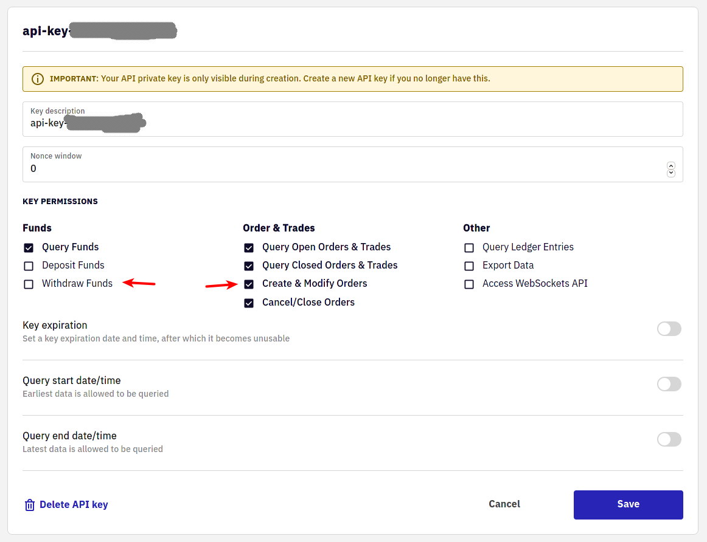

# Configuration

Unfortunately we need to configure a few things before you can start automatic trading with this software. Most configuration is done in a [YAML](https://yaml.org/) file. Create this file and open it in a text editor. We will talk you through the necessary steps and show snippets to put into. Depending on your platform, the path should be this:

| Platform | Location |
| --- | --- |
| Linux | `~/.config/vigilant-crypto-snatch/config.yml` |
| Windows | `C:\Users\<User>\Application Data\Martin Ueding\vigilant-crypto-snatch\config.yml` |
| macOS | `~/Library/Application Support/vigilant-crypto-snatch/config.yml`

## Historic price API

In order to find a drop in the price, we need to know the historic price at a given point. We use Crypto Compare for that as they provide a free API. Go to [their website](https://min-api.cryptocompare.com/pricing) and create an API key.

> 

And retrieve your API key:

> 

In the configuration file then add the following:

```yaml
cryptocompare:
  api_key: 'your API key here'
```

## Marketplaces

We currently support two marketplaces, [Bitstamp](https://bitstamp.net/) and [Kraken](https://kraken.com). You only have to configure one of them, but you can also configure both. When you start the program, you can just choose which marketplace you want to use today.

### Bitstamp

In order to use Bitstamp, you need to set up an API key with them that has the correct permissions to trade with. Go to the *settings* menu and create a new key.

> 

Put this API key into the configuration file.

```yaml
bitstamp:
  username: 'username here'
  key: 'key here'
  secret: 'secret here'
```

### Kraken

Go to the [Kraken API key page](https://www.kraken.com/u/security/api) and create an API key which has the permission to trade.

There you need to create a new API key:


Be sure to select the _Create & Modify Orders_ permission such that the program can actually execute orders. Give the least amount of permissions, you certainly don't want _Withdraw Funds_.



You will get an API key and an associated secret. In the configuration file you add a paragraph like the following. The first will be API key and the second will be the secret, like this:

```
kraken:
  key: YOUR KEY
  secret: YOUR SECRET
```

There is nothing to add to our main configuration file.

## Triggers

First you should set the polling interval that the main loop should use. It will wait this many seconds before checking again. For testing we found that 5 seconds is a good value, for production use 60 seconds should be absolutely sufficient.

```yaml
sleep: 60
```

You can define as many triggers as you would like. This is done in a section `triggers`. Let us show an example first and explain all the keys below.

```yaml
triggers:
- coin: btc
  fiat: eur
  cooldown_minutes: 1440
  volume_fiat: 26.0
  delay_minutes: 1440
  drop_percentage: 10
- name: "Medium drops"
  coin: btc
  fiat: eur
  cooldown_minutes: 1440
  volume_fiat: 26.0
  delay_minutes: 1440
  drop_percentage: 5
- coin: btc
  fiat: eur
  cooldown_minutes: 5000
  volume_fiat: 26.0
```

There are different sub-types, but all of them have the following elements in common:

- `coin`: The name of the crypto-currency, case insensitive.
- `fiat`: The name of the fiat currency, case insensitive.
- `cooldown_minutes`: Minutes until a trigger can fire again.
- `name`: Optional human-readable name of the trigger.

The internal name of the trigger can be derived from the options. This will give you technical names in notifications, so you might prefer to give them personal names. Additionally the name is used in the database to compute the cooldown. If you don't have a name specified and change any of the parameters, the internal name will change and cooldown doesn't apply any more.

### Trigger strategy

We currently have two trigger strategies.

One is a fixed time interval, which is basically the *dollar cost average* strategy. For this you don't have any additional keys.

The other is the *drop* strategy. It will look whether the price has dropped by a given *percentage* within a given *delay*. You could for instance look for a drop of 1 % within 60 minutes. You will need to specify these keys:

- `drop_percentage`
- `delay_minutes`

You can specify a decimal number for the drop percentage, just be aware that it must contain a decimal point instead of a decimal comma.

### Fiat volume strategy

There are two ways that you can determine the amount of fiat volume that you want to spend on each trigger execution.

First there is the *fixed* strategy, where you always spend a fixed amount. For that you need this key:

- `volume_fiat`: Amount in fiat currency.

Alternatively you can specify a percentage of the amount of fiat currency that you have on the market. For this specify a percentage:

- `percentage_fiat`: Percentage of fiat money to spend in each buy.

## Telegram notifications

Optionally you can set up notifications via Telegram. This is not required, but a nice extra to allow monitoring from anywhere.

First you have to create a bot by talking to [@botfather](https://t.me/botfather). It will lead you through a couple of steps:

1. Type `/start` to initiate the bot creation.
2. Then type `/newbot` to create your bot.
3. It will ask you for the name of the bot. You can just use “vigilant-crypto-snatch” or something else.
4. Next it will ask for a username of the bot. This is a technical thing, so it doesn't need to be pretty. It needs to be unique and end with `bot`. So perhaps use something like `vigilant_0f8704a83991_bot`, where you just make up your own random letters.

It will give you an access token that you can use for the API. Enter that token into the configuration file:

```yaml
telegram:
  token: 'Your bot token here'
  level: info
```

You will need to write a message to the bot in order to open a direct conversation with it. This is necessary such that the bot can reply to you.

The `level` specified the messages that you want to receive. `info` gives sensible information, if you only want to receive information when something goes wrong, use `warning`. See the section in [running](running.md) for more details.

If the Telegram bot token is set up correctly, you will receive messages like this:

> 

The severity of messages is color-coded with an emoji according to this mapping:

Symbol | Severity
:---: | :---
🔴 | Critical
🟠 | Error
🟡 | Warning
🟢 | Info
🔵 | Debug

The logging level is set to *Info* by default. You must not set it to *Debug* as sending a Telegram message will produce more debug messages. The program will crash with an infinite recursion.