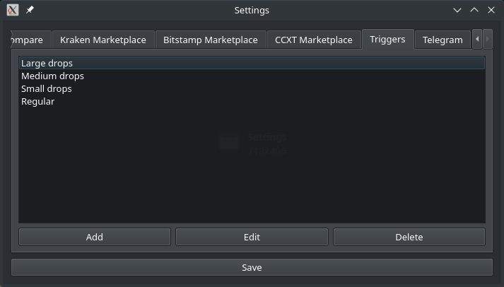
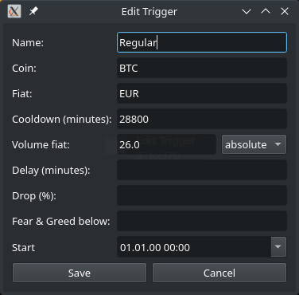

 
# Triggers

You can define as many triggers as you would like. This is done in a section `triggers`.



You can add as many as you would like, and the options look like this:



In the configuration file it would look like this:

```yaml
triggers:
- name: "Large drops"
  coin: btc
  fiat: eur
  cooldown_minutes: 1440
  volume_fiat: 26.0
  delay_minutes: 1440
  drop_percentage: 10
- name: "Medium drops"
  coin: btc
  fiat: eur
  cooldown_minutes: 1440
  volume_fiat: 26.0
  delay_minutes: 1440
  drop_percentage: 5
- name: "Regular"
  coin: btc
  fiat: eur
  cooldown_minutes: 5000
  volume_fiat: 26.0
```

There are different sub-types of triggers, but all of them have the following elements in common:

- `coin`: The name of the crypto-currency, case insensitive.
- `fiat`: The name of the fiat currency, case insensitive.
- `cooldown_minutes`, `cooldown_hours`, `cooldown_days`: Time until a trigger can fire again. If multiple ones are given, only the one with the largest unit will be used.
- `name`: Human-readable name of the trigger.

    The internal name of the trigger can be derived from the options. This will give you technical names in notifications, so you might prefer to give them personal names. Additionally the name is used in the database to compute the cooldown. If you don't have a name specified and change any of the parameters, the internal name will change and cooldown doesn't apply any more.

- `start`: Optional date time string which specifies the earliest execution of the trigger.

    This can be used if you have just created a bunch of new triggers, or made changes to them without keeping the `name` attribute fixed. By specifying a future point in time you can prepare a trigger without having it executed on the next run of the program.
    
    We use [`dateutil.parser`](https://dateutil.readthedocs.io/en/stable/parser.html) to parse the date. It will understand most formats, but the ISO format (`YYYY-MM-DD HH:MM:SS`) will certainly work.

## Trigger strategy

We currently have two optional trigger strategies. All strategies also use the cooldown. If you do not specify any strategy keys, then it will just buy whenever the cooldown has expired. This is the “Dollar cost average” way.

You can use as many strategies as you like. They are connected via logical _and_, meaning that all strategies have to say “buy” in order for the trigger to fire.

### Drop strategy

The first strategy is the *drop* strategy. It will look whether the price has dropped by a given *percentage* within a given *delay*. You could for instance look for a drop of 1 % within 60 minutes. You will need to specify these keys:

- `drop_percentage`
- `delay_minutes`, `delay_hours` or `delay_days`: If multiple are given, only the one with the largest unit will be used.

You can specify a decimal number for the drop percentage, just be aware that it must contain a decimal point instead of a decimal comma.

### Fear & Greed strategy

There is the [Fear & Greed Index](https://alternative.me/crypto/fear-and-greed-index/), which provides a market analysis via multiple factors. It is a number between 0 and 100. Low numbers mean that people are fearful and it might be good to buy. And high numbers mean that people are greedy and it might be a bad idea to buy.

You can specify the following key to make use of this strategy.

- `fear_and_greed_index_below`: An integer value between 0 and 101 which is the exclusive upper limit for the fear and greed index. If you specify 50, then it will only buy for 49 or below.

## Fiat volume strategy

There are two ways that you can determine the amount of fiat volume that you want to spend on each trigger execution.

First there is the *fixed* strategy, where you always spend a fixed amount. For that you need this key:

- `volume_fiat`: Amount in fiat currency.

Alternatively you can specify a percentage of the amount of fiat currency that you have on the market. For this specify a percentage:

- `percentage_fiat`: Percentage of fiat money to spend in each buy.

## Choosing sensible values

But what shall I choose? What will give me the most return of investment? We don't have the truth either, but we recommend that you take a look at the evaluation interface that is linked on the [usage](../usage/general.md) page. The heatmap of drops gives you a good idea of which delays and drop percentages to use. The trigger simulation gives you an idea of how often they fire, and let you choose the amount of fiat to spend.

You can also come to the Telegram group, see [support](../support.md), and ask other users for their experience.