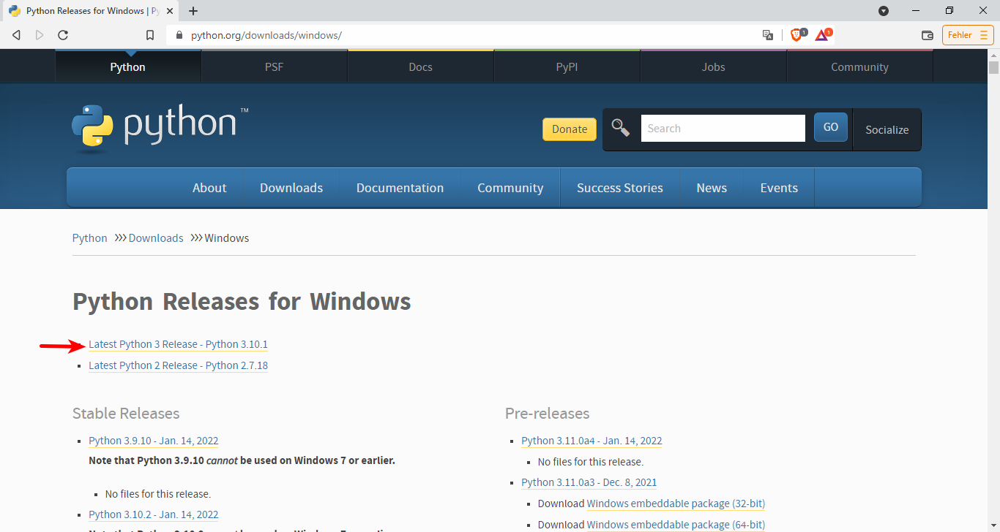
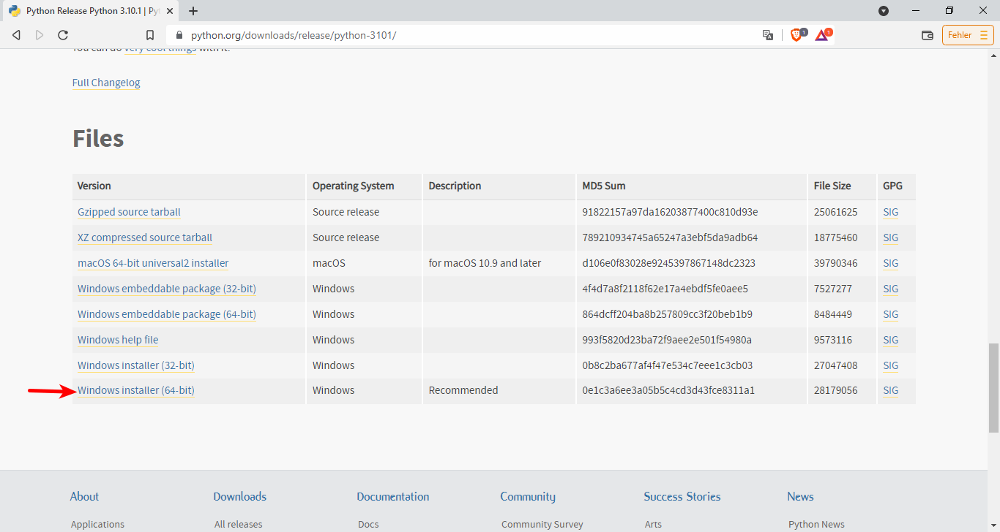
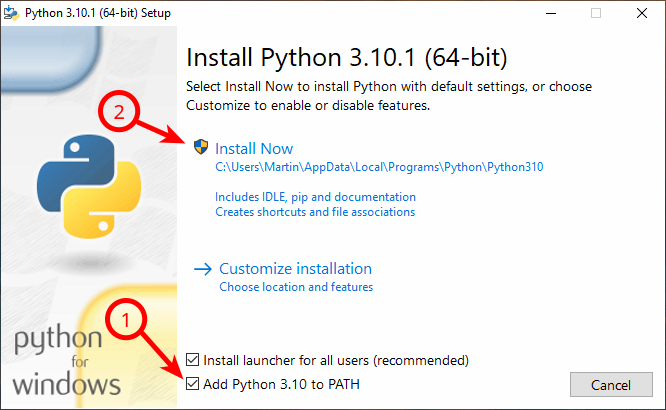

# Installation on Windows

If you want to use the program on Windows, you will first have to install Python.

## Installing Python

Go to the [Python website](https://www.python.org/downloads/windows/):

Then download the Windows Installer for 64-Bit:

Launch the installer, and add Python to the PATH. This will make it easier later on.

Then just press “Install Now”.

After the setup has gone through, it will allow you to extend the command line limit. This might be necessary, I would just do that.

Then you are finished and have Python installed on your system.

## Installing the program

Then open a command line by pressing <kbd>Windows</kbd> and type “cmd” to launch the command line. You will see a window like this:

Then type `pip install vigilant-crypto-snatch` and press <kbd>Enter</kbd>. It will start to download the latest version of the program:

Eventually it will finish and show you the command line again:

You should be able to start `vigilant-crypto-snatch` without arguments by typing that now:

If you get this help screen, then everything is installed correctly.

## Creating the config file

Next you will need to go through the configuration. We first need to create the directory for that. Open the Explorer and navigate to your user directory:

Then click into the address bar such that you can change the path. Append an `AppData` to it, like this:

After pressing <kbd>Enter</kbd>, you will see `Local`, `LocalLow` and `Roaming`. Double-click on `Roaming`. Then you should find various directories from applications that you use.

Create a new directory `Martin Ueding` and then inside that create another called `vigilant-crypto-snatch`. Go into that directory:

Then right-click to create a new “text file” called `config.yml`. You can edit that configuration file using the “Notepad” editor from Windows. Alternatively you can download a programmer's editor like [Atom](https://atom.io/) or [Notepad++](https://notepad-plus-plus.org/). Fill in the configuration as described in the [configuration documentation](../configuration/general.md).

After adding all the configuration, this is how the test-drive will look like:

