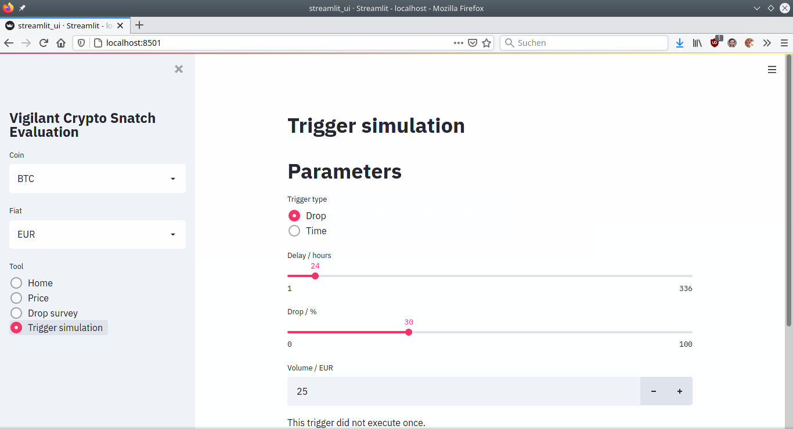
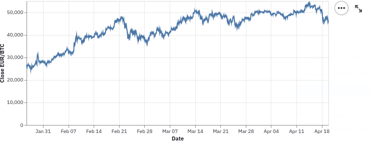
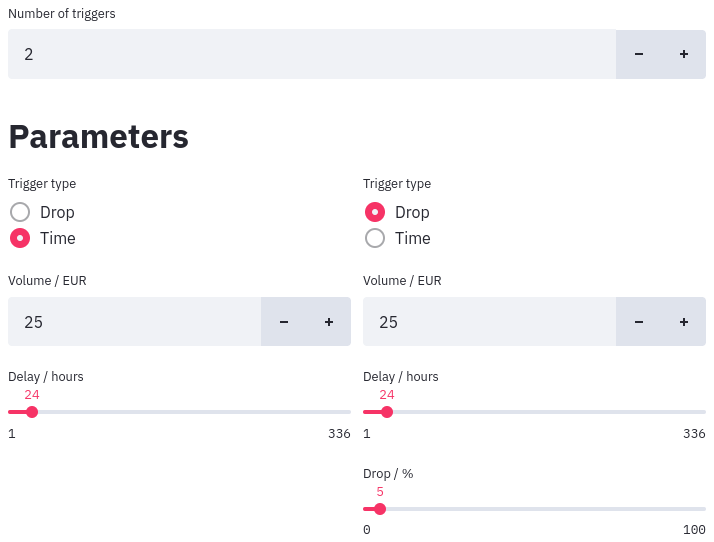
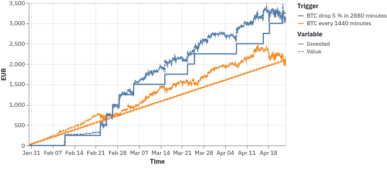
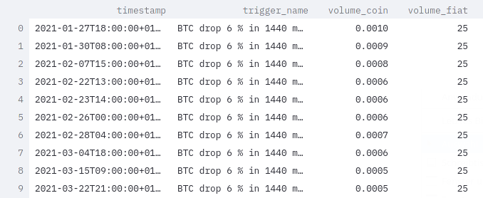
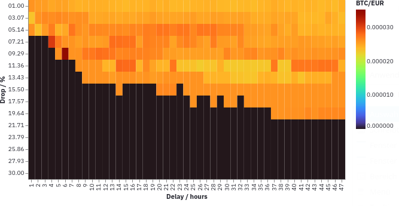

# Usage

This page is about invoking the program in an interactive or manual way. This is the right thing if you are just configuring it and want to test it. For production use, see the page about [deployment](deployment.md).

The program has a hierarchical command line interface with multiple subcommands. If you have installed it system-wide, you can just directly call it. Otherwise you might have to add `~/.local/bin` to your `PATH` variable. With the `--help` option you will see an up-to-date list of options.

The general structure of a call is this:

```
vigilant-crypto-snatch [general options] subcommand [subcommand options]
```

The general options are the following:

- `--loglevel`: The program can emit a lot of status output while running. You can specify a *log level* with `--loglevel LEVEL`, where `LEVEL` can be `critical`, `error`, `warning`, `info` or `debug`. The `info` level is the default and does not fill the terminal with tons of output. You can set it to `debug` if you want to have more output and want to diagnose your triggers.

## Subcommand test-drive

In order to check your configuration, use the `test-drive` subcommand. It will accept this option:

- `--marketplace MARKETPLACE`: We support two marketplaces, you can select either `bitstamp` or `kraken`.

It will test the following things:

- Can the database be loaded?
- Can we receive the balance from your marketplace? This verifies whether you have set up your private keys.
- Can we retrieve a historical price?
- Can your triggers be constructed?
- Can a message be sent via Telegram, if you have set it up?

If that runs through, you have a working configuration.

## Subcommand watch

The main command is `watch`.  It will monitor the market and place buy orders.

There are a couple of command line options:

- `--marketplace MARKETPLACE`: We support two marketplaces, you can select either `bitstamp` or `kraken`.

When you want to quit, just press <kbd>Ctrl</kbd>+<kbd>C</kbd>.

All historical price data and performed transactions will be stored in a SQLite database at `~/.local/share/vigilant-crypto-snatch/db.sqlite` (elsewhere on Windows). We sometimes change the database format between major releases. In that case it is easiest to delete the database and let the script create the new one. As there are only so few users, we don't offer proper database migrations.

An example for running the script with log level info on Kraken:

```
vigilant-crypto-snatch --loglevel info watch --marketplace kraken --keepalive
```

### Nonce rejections with Kraken

If you happen to get nonce errors with the Kraken marketplace, consider using less triggers for it, or modifying your API key according to [their guide](https://support.kraken.com/hc/en-us/articles/360001148063-Why-am-I-getting-Invalid-Nonce-Errors-).

## Subcommand evaluate

It is not inherently clear how triggers should be set. There are multiple variables that have to be tuned for *each* trigger:

- Time delay
- Cooloff
- Drop percentage
- Fiat volume

We can try to verify a given strategy using historical data. We can also use the historical data to get an idea of a good strategy. Then we just simulate the given triggers and see how they perform.

We provide a fun experimentation interface which is built with [Streamlit](https://streamlit.io/) and runs directly in your browser.



This interface can be [used online using the hosted version](https://share.streamlit.io/martin-ueding/vigilant-crypto-snatch/vigilant_crypto_snatch/streamlit_ui.py). Alternatively it can be started locally using the `evaluate` subcommand without any additional parameters:

```
vigilant-crypto-snatch evaluate
```

You can then select a crypto and a fiat currency to use for the analysis. Then you can just switch between the various tools that are offered. These are described below.

### Possible errors

It might be possible that you cannot start the Streamlit interface. The most basic error could be an `ImportError` saying that the package `altair` or `streamlit` could not be imported. In that case you haven't installed the evaluation extra. See the installation instructions on the front page.

While starting it, you might get an error about too many files connected via inotify. In this case you need to create a file at `.streamlit/config.toml` and give it this content:

```toml
[server]
fileWatcherType = "none"
```

### Price tool

Here you can just see the prices that we got from the historical API. This is nothing special, just a plot.

> 

These plots are slightly interactive, so you can make them fullscreen and they will render with higher quality.

### Trigger simulation tool

You simulate triggers on historical data. You can limit the evaluation data to a given range. Unfortunately Streamlit doesn't support a range slider yet, so the numbers don't make so much sense. The actual date is shown right below and will be updated as you move the slider.

> 

You can simulate as many triggers as you like. Set the number that you want and then just select the type of trigger and tune the parameters to your liking.

> 

It will give you a summary table looks like this:


You can make this table full screen and also sort by any column. Just click on a column header and it will sort.

You will also get a plot which shows the amount of money you have invested as well as the value of the crypto assets aquired. With this you can get a sense on the gains.

> 

The plot is interactive, you can pan and zoom with the mouse.

You also have a table with the trades that were performed.

> 

In case the trigger has not been executed once, you will of course get a message.

### Drop survey tool

Fiddling with individual triggers can be informative, but a more meta view could be very helpful. For this all sorts of drop triggers are performed, with a grid of various delays and various drop percentages.

You can control the ranges of both with two-way sliders.

> 

Each time such a trigger is executed a fixed unit of fiat currency is invested. At the end of the time period the amount of crypto currency is normalized by the amount of fiat currency spent. This will show the most efficient triggers. It doesn't show how often these triggers have been used, or how much crypto currency you will have in the end.

> 

In the resulting heat map you can see colored areas where the most gains are in a dark red. In regions where the trigger has never been executed, you will just see black. These regions indicate that there was no such drop in the period looked at.

Likely there will be one really dark area. This is an artefact from a single large drop in the past three months. Of course this is the best drop trigger for that particluar period, but it does not really generalize. So be wary that different historical periods look differently.

Use this plot to get a general sense of fluctuations in the market and which triggers would fire often and form a good base strategy. In the above image, having a trigger at around 10 % and 24 hours delay seems to be a reasonable choice.

You might still want to include some really ambitious triggers such that you can realize large gains. For instance having one for 25 % within 48 hours could be a good idea.